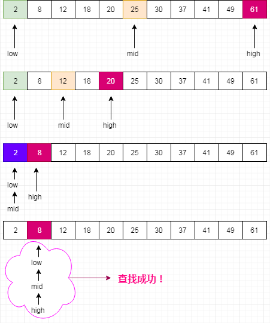

#Java算法  

## Java二分查找
 **什么是二分查找？**  
 二分查找（binary search）又叫折半查找，它是一种在**有序数组**中查找**某一特定元素**的搜索算法。  
 
 **二分查找条件？**  
 - 必须为顺序存储结构；
 - 必须按关键字大小有序排列。  
 
 **二分查找原理：**  
 例如：使用二分查找算法找出arrays数组中8的位置
 ```text
 int[] arrays = new int[] {2,8,12,18,20,25,30,37,41,49,61};
```
- 将有序数组分为三个部分，分别为中间值前（中间值数之前的一组数据），中间值和中间值后（中间值之后的一组数据）；
- 将要查找的数与中间值的数相比较，等于则退出查找，小于则在中间值前进行比较，大于在在中间值后进行比较,依次递归，直至查找到对应的值为止；
- 此处中间值为{25}，中间值前为{2,8,12,18,20}，中间值后为{30,37,41,49,61}。  
图例：  
