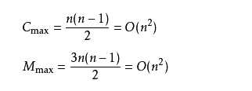

# Java算法  

## Java Binary Search
 **什么是二分查找？**  
 二分查找（binary search）又叫折半查找，它是一种在**有序数组**中查找**某一特定元素**的搜索算法。  
 
 **二分查找必要条件？**  
 - 必须为顺序存储结构；
 - 必须按关键字大小有序排列。  
 
 **二分查找原理：**  
 例如：使用二分查找算法找出arrays数组中8的位置
 ```text
 int[] arrays = new int[] {2,8,12,18,20,25,30,37,41,49,61};
```
- 将有序数组分为三个部分，分别为中间值前（中间值数之前的一组数据），中间值和中间值后（中间值之后的一组数据）；
- 将要查找的数与中间值的数相比较，等于则退出查找，小于则在中间值前进行比较，大于在在中间值后进行比较,依次递归，直至查找到对应的值为止；
- 当要查找数据结构为偶数时，中间值mid应向下取整处理；
- 上述arrays数组中间值为{25}，中间值前为{2,8,12,18,20}，中间值后为{30,37,41,49,61}。  

**二分查找计算原理图，如下：**    
  

**二分查找常用两种方式：**
- 递归查询  
```text
    /**
     * 二分查找递归查询
     *
     * @param arrays 要查找的有序数组
     * @param low    头指针初始位置
     * @param high   尾指针初始位置
     * @param key    要查找的数
     * @return
     * @Description: <br/>
     * int mid = low + (high - low) / 2;
     * 此算法不存在溢出问题，因为他能保证计算出来的mid，一定是大于low，小于high的。
     */
    public static int recursiveBinarySearch(int[] arrays, int low, int high, int key) {
        // 计算中间索引值
        int mid = low + (high - low) / 2;

        // 判断查找的数是否在数组中;
        // 如果此处不加判断，则有可能报 java.lang.StackOverflowError栈内存溢出
        if (low > high || key > arrays[high] || key < arrays[low]) {
            return -1;
        }

        if (arrays[mid] > key) {
            // mid所对应的值比key大，key应该在左边区域
            return recursiveBinarySearch(arrays, low, mid - 1, key);
        } else if (arrays[mid] < key) {
            //mid所对应的值比key小，key应该在右边区域
            return recursiveBinarySearch(arrays, mid + 1, high, key);
        } else {
            return mid;
        }
    }
```
- 非递归查询
```text
    /**
     * 二分查找非递归查询
     *
     * @param arrays 要查找的有序数组
     * @param key    要查找的值
     * @return
     * @Description: 中间索引值计算方式有以下两种<br>
     * int mid = low + (high - low) / 2;
     * <p>
     * //防止溢出
     * int mid = (high + low) >>> 1;
     * 说明：要查询数组为偶数个时，需向下取整
     * <br/>
     */
    public static int unRecursiveBinarySearch(int[] arrays, int key) {
        // 头指针初始位置
        int low = 0;
        // 尾指针初始位置
        int high = arrays.length - 1;

        // 判断查找的数是否在数组中;
        // 如果此处不加判断，则有可能报 java.lang.StackOverflowError栈内存溢出
        if (low > high || key > arrays[high] || key < arrays[low]) {
            return -1;
        }

        //确保不会出现重复查找，越界
        while (low <= high) {
            //计算出中间索引值，防止溢出
            int mid = (high + low) >>> 1;
            if (key == arrays[mid]) {
                return mid;
            } else if (key < arrays[mid]) {
                // mid所对应的值比key大，key应该在左边区域
                high = mid - 1;
            } else {
                // mid所对应的值比key小，key应该在右边区域
                low = mid + 1;
            }
        }
        //若没有，则返回-1
        return -1;
    }
```  
- main方法
```text
   public static void main(String[] args) {
        int[] arrays = new int[]{1, 2, 3, 4, 5, 6, 7, 9};
        int key = 6;
        int low = 0;
        int high = 6;
        // 非递归查找
        int i = unRecursiveBinarySearch(arrays, key);
        System.out.println("非递归查找，索引值为：" + i);
        // 递归查找
        int recursiveInt = recursiveBinarySearch(arrays, low, high, key);
        System.out.println("递归查找，索引值为：" + recursiveInt);
    }
```
**时间复杂度和空间复杂度**
- 时间复杂度：
    - 最坏的情况下两种方式时间复杂度一样：O(log2 N);
    - 最好情况下为O(1);

- 空间复杂度：算法的空间复杂度并不是计算实际占用的空间，而是计算整个算法的辅助空间单元的个数;
    - 非递归方式：由于辅助空间是常数级别的所以：空间复杂度是O(1);
    - 递归方式：递归的次数和深度都是log2 N,每次所需要的辅助空间都是常数级别的：空间复杂度：O(log2N )

**二分查找***中值(mid)***计算**
二分查找中值计算有两种方式：
- int mid = (low + high) / 2;  
- int mid = low + (high - low) / 2;  
上述两种算法看似第一种要简洁，第二种提取之后，跟第一种没有什么区别。但是实际上上述两种计算是有区别的，第一种的做法是在极端情况下计算的，(low + high)存在着溢出的风险，进而有可能得到错误的mid结果，导致程序错误；而第二种算法能够保证计算出来的mid值一定大于low、小于high，不存在溢出的问题。
针对第一种算法为了防止溢出问题，可以使用：int mid = (high + low) >>> 1; 解决此问题。

**二分查找的优缺点：** 
- 优点：比较次数少，查找速度快，平均性能好。
- 缺点：必须有序，必须是数组。

**引申**  
解决二分查找缺陷问题更好的方法是使用二叉查找树，最好自然是自平衡二叉查找树，既能高效的（O(n log n)）构建有序元素集合，又能如同二分查找法一样快速（O(log n)）的搜寻目标数。  

## Java Bubble Sort  
**什么是冒泡排序法？**  
这个算法的名字由来是因为越大的元素会经由交换慢慢“浮”到数列的顶端（升序或降序排列），就如同碳酸饮料中二氧化碳的气泡最终会上浮到顶端一样，故名“冒泡排序”。  

**冒泡排序原理**  
- 比较相邻的元素。如果第一个比第二个大，就交换他们两个。
- 对每一对相邻元素做同样的工作，从开始第一对到结尾的最后一对。在这一点，最后的元素应该会是最大的数。
- 针对所有的元素重复以上的步骤，除了最后一个。
- 持续每次对越来越少的元素重复上面的步骤，直到没有任何一对数字需要比较。    
- 冒泡排序过程图 
    

**算法分析**
- 时间复杂度  
    - 如果数据是正序，只需要走一趟即可完成排序。所需的比较次数**C**和记录移动次数**M**均达到最小值，即：Cmin=n-1;Mmin=0;所以冒泡排序最好的时间复杂度为O(n)。
    - 如果数据是反序，则需要进行n-1趟排序。每趟排序要进行**n-i**次比较(1≤i≤n-1)，且每次比较都必须移动记录三次来达到交换记录位置。在这种情况下，比较和移动次数均达到最大值：  
    
    即最坏情况下时间复杂度为O(n2)【n的平方】;  
    - 所以，冒泡排序总的平均时间复杂度为：O(n2)。  
- 算法稳定性    
冒泡排序就是把小的元素往前飘或者把大的元素往后飘。比较是相邻的两个元素之间比较，交换也发生在这两个元素之间。所以如果两个元素相等，是不会再交换的；如果两个相等的元素没有相邻，那么即使通过前面的两两交换把两个相邻起来，这时候也不会交换，所以相同元素的前后顺序并没有改变，所以冒泡排序是一种稳定排序算法。
