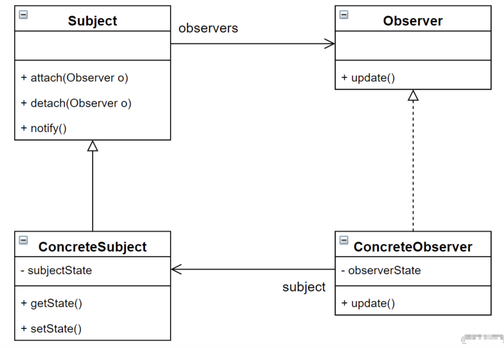

# 观察者模式

观察者模式是对象的行为模式，又叫发布-订阅(Publish/Subscribe)模式、模型-视图(Model/View)模式、源-监听器(Source/Listener)
模式或从属者(Dependents)模式。

观察者模式定义了一种一对多的依赖关系，让多个观察者对象同时监听某一个主题对象；这个主题对象在状态上发生变化时，会通知所有观察者对象，使它们能够自动更新自己。

## 观察者模式结构

**观察者模式结构图：**


**观察者模式所涉及的角色：**

- Subejct（抽象目标/主题）：又叫主题，指被观察的对象，也就是被观察者，在目标中定义了一个观察者集合，同时提供一系列方法来增加、删除观察者对象，以及通知方法notify();
- ConcreteSubject（具体目标）： 抽象目标的子类，通常包含有经常改变的数据，当状态发生改变时，向各个观察者发出通知。同时还实现了目标类中定义的抽象业务逻辑，如果无须扩展抽象目标类则可以省略具体目标类；
- Observer（抽象观察者）：对观察目标作出响应，一般定义为接口；
- ConcreteObserver（具体观察者）：具体观察者中维护一个指向具体目标的引用，存储具体观察者的有关状态，这些状态需要与具体目标的状态保持一致，同时实现了抽象观察者的update()
方法。

## 典型实现

### 实现步骤
- 定义抽象观察者（Observer）：接口/抽象类，声明状态更新方法；
- 定义具体观察者（ConcreteObserver）：继承/实现抽象观察者，实现状态更新方法；
- 定义抽象目标类（Subject）：包含一个存储抽象观察者的集合，与一个类似notifyObserver的通知观察者的抽象方法；
- 定义具体目标（ConcreteSubject）：继承抽象目标类，实现其中通知观察者的方法。

**定义抽象观察者（Observer）**
```java
public interface Observer{
    /**
     * 更新接口，该接口由被观察者调用
     * 
     * @param state    更新的状态
     */
    void update(String state);
}

```

**定义具体观察者（ConcreteObserver）**
```java
public class ConcreteObserver implements Observer {
    // 更新状态
    public String state;
    
    // 构造方法
    public ConcreteObserver(String state) {
        this.state = state;
    }
    
    @Override
    public void update(String state)    {
        System.out.println("观察者状态更新为：" + state);
    }
}
```
**定义抽象目标类（Subject）**
```java
public abstract class Subject {
    /**
     * 用来保存注册的观察者对象
     */
    private List<Observer> list = new ArrayList<Observer>();
    /**
     * 注册观察者对象
     * 
     * @param observer    观察者对象
     */
    public void attach(Observer observer){
        list.add(observer);
    }
    
    /**
     * 删除观察者对象
     * @param observer    观察者对象
     */
    public void detach(Observer observer){
        list.remove(observer);
    }

    /**
     * 通知所有注册的观察者对象
     * 
     * @param state
     */
    public void nodifyObservers(String state){
        list.foreach(item -> item.update(state));
    }
    
    public abstract void change(String newState);
}
```

**定义具体目标（ConcreteSubject）**
```java
public class ConcreteSubject extends Subject{
    // 状态
    private String state;
    
    // getter方法
    public String getState() {
        return state;
    }

	@Override
    public void change(String newState) {
        state = newState;
        System.out.println("被观察者状态为:"+newState);
        notifyObservers(newState);
    }
}
```

**客户端**
```java
public class Client{
    public void main(String[] arg){
        // 创建两个观察者
        Observer observerOne = new ConcreteObserver("观察者1状态信息");
        Observer observerTwo = new ConcreteObserver("观察者2状态信息");
        
        // 目标类/主题类创建
        Subject subject = new ConcreteSubject();
        subject.attach(observerOne);
        subject.attach(observerTwo);
        
        // 调用目标类/主题类型change()方法，传入状态改变信息
        subject.change("状态改变了！！！！！");
    }
}
```
